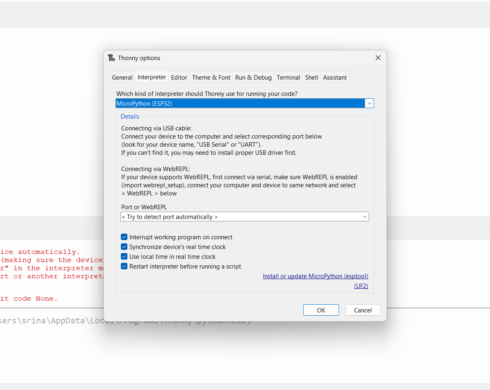
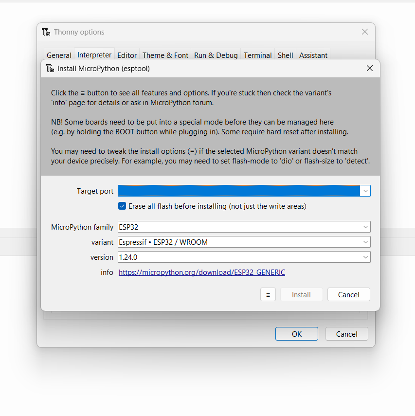
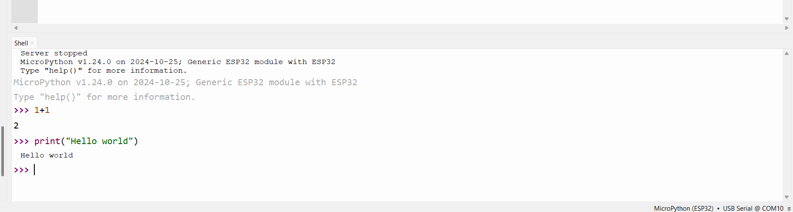

<div align="center">

  <h1>Pen-Plotting Robot</h1>
  
  <p>
    An open-source, python-based cartesian pen-plotting robot for CS education
  </p>
  
  
<!-- Badges
<p>
  <a href="https://github.com/srinath-iyer/Pen-Plotting-Bot/graphs/contributors">
    
  </a>
  <a href="">
    
  </a>
  <a href="https://github.com/srinath-iyer/Pen-Plotting-Bot/network/members">
    
  </a>
  <a href="https://github.com/Louis3797/awesome-readme-template/stargazers">
    
  </a>
  <a href="https://github.com/Louis3797/awesome-readme-template/issues/">
    
  </a>
  <a href="https://github.com/Louis3797/awesome-readme-template/blob/master/LICENSE">
    
  </a>
</p>
    -->
<h4>
    <a href="https://github.com/Louis3797/awesome-readme-template/">View Demo</a>
  <span> · </span>
    <a id = #documentation href="https://github.com/Louis3797/awesome-readme-template">Documentation</a>
  <span> · </span>
    <a href="https://github.com/Louis3797/awesome-readme-template/issues/">CAD Model</a>
  <span> · </span>
    <a href="https://github.com/Louis3797/awesome-readme-template/issues/">More</a>
  </h4>
</div>

<br />

<!-- Table of Contents -->
# :notebook_with_decorative_cover: Table of Contents

- [About the Project](#about-the-project)
  * [Motivation](#motivation)
  * [Screenshots](#screenshots)
  * [Tech Stack](#tech-stack)
- [Getting Started](#getting-started)
  * [Prerequisites](#bangbang-prerequisites)
  * [Installation](#gear-installation)
    * [Step 1: Set up Micropython](#step-1-set-up-micropython)
    * [Step 2: Edit script.py and other files locally:](#step-2-edit-scriptpy-and-other-files-locally)
  * [Editing Code](#editing-code)
  * [Run Locally](#running-run-locally)
  * [Deployment](#triangular_flag_on_post-deployment)
- [Usage](#eyes-usage)
- [Roadmap](#compass-roadmap)
- [Contributing](#wave-contributing)
  * [Code of Conduct](#scroll-code-of-conduct)
- [FAQ](#grey_question-faq)
- [License](#warning-license)
- [Contact](#handshake-contact)
- [Acknowledgements](#gem-acknowledgements)

  

<!-- About the Project -->
## About the Project

### Motivation
This project was in response to a request by the EGR105L first year computing course at Duke University. 

<!-- Screenshots -->
### :camera: Screenshots

<div align="center"> 
  
</div>


<!-- TechStack -->
### Tech Stack

- Micropython: An efficient implmentation of the Python 3 language optimized for running on microcontrollers.
  - `bot.py`: A low level library that deals with robot control and direct microcontroller communication as well as simple controls functions so you can focus on developing higher-complexity algorithms.
  - `main.py` and `boot.py`: ESP32 native files that are run upon startup.
  - `script.py`: A canvas for the user to write and test their own commands and methods.
- HTML/JS/CSS: Implementation of a socket web server for a User Interface and diagnostic dashboard.

<!-- Getting Started -->
## 	:toolbox: Getting Started

<!-- Prerequisites -->
### Prerequisites


Before starting this project, you should have some sort of code editor installed (VSCode highly recommended) as Thonny IDE is not a good development environment and mostly serves as a conduit to run the ESP32 microcontroller on the robot. You should also have the assembled robot (see [Documentation](https://www.google.com) for more information) and an ESP32.

Additionally, it is highly recommended that you have git installed and set up, and that you fork this repository, since you will need to make changes to `script.py`. You are welcome to play around with any files, but for the smoothest results, it is recommended that you do not modify `main.py`, `boot.py`, `bot.py`, or `interface.html`, instead using the UI and `script.py` to do any robot operations you need.

<!-- Installation -->
### Installation

#### Step 1: Set up Micropython 

If you have not installed micropython on your ESP32 or downloaded Thonny, start here. If you've already completed these two steps or are working with an already setup robot, skip to the next step.

First, go to the [Thonny IDE](https://thonny.org/) website and download the correct version according to your operating system.

Next, plug in the ESP32 microcontroller into your computer and open Thonny. Click `Run -> Configure Interpreter -> Which kind of interpreter? -> Select Micropython (ESP32)`.
<div align="left"> 
<br>
  
</div>
<br>

Next, click `Install or Update MicroPython` and using the following options, install micropython. Note: you will need to know what port your device is connected to. You can do this by trial and error. Usually, the correct option will say something like "USB Serial", but depends on your device. After you've selected the right port, you should click `install`. This will take a minute or two.

<br>
<div align="left"> 
  
</div>
<br>

Now, you should have both Thonny set up and installed Micropython on your ESP32. You can test this by connecting your device in Thonny In the main menu, select `Run -> Configure Interpreter -> Which kind of interpreter? -> Select Micropython (ESP32)` and select `<Try to detect port automatically>`. Once you connect by pressing `OK`, you should be able to type basic commands in the REPL (Terminal) like below. If this works, then you have successfully completed configuration. If not, start Step 1 again, and if issues persist, consult Google or contact us.

<br>

<div align="left"> 
  
</div>

<br>

#### Step 2: Edit script.py and other files locally:

First, fork this repo. You can do that at the top with the button that says `Fork`. 

Next, open your terminal (or the terminal in VS Code or other IDEs of your chosing) and clone the repo with either HTTPS or SSH (SSH recommended).

```bash
git clone git@github.com:srinath-iyer/Pen-Plotting-Bot.git
```

Additionally, if you don't want to use git, you can export the repo as a zip file and open it in any IDE.

<br>

<!-- Running Tests -->
### :test_tube: Editing Code

To run tests, run the following command

```bash
  yarn test test
```

<!-- Run Locally -->
### :running: Run Locally

Clone the project

```bash
  git clone https://github.com/Louis3797/awesome-readme-template.git
```

Go to the project directory

```bash
  cd my-project
```

Install dependencies

```bash
  yarn install
```

Start the server

```bash
  yarn start
```


<!-- Deployment -->
### :triangular_flag_on_post: Deployment

To deploy this project run

```bash
  yarn deploy
```


<!-- Usage -->
## :eyes: Usage

Use this space to tell a little more about your project and how it can be used. Show additional screenshots, code samples, demos or link to other resources.


```javascript
import Component from 'my-project'

function App() {
  return <Component />
}
```

<!-- Roadmap -->
## :compass: Roadmap

* [x] Todo 1
* [ ] Todo 2


<!-- Contributing -->
## :wave: Contributing

<a href="https://github.com/Louis3797/awesome-readme-template/graphs/contributors">
  
</a>


Contributions are always welcome!

See `contributing.md` for ways to get started.


<!-- Code of Conduct -->
### :scroll: Code of Conduct

Please read the [Code of Conduct](https://github.com/Louis3797/awesome-readme-template/blob/master/CODE_OF_CONDUCT.md)

<!-- FAQ -->
## :grey_question: FAQ

- Question 1

  + Answer 1

- Question 2

  + Answer 2


<!-- License -->
## :warning: License

Distributed under the MIT License. See LICENSE.txt for more information.


<!-- Contact -->
## :handshake: Contact

Srinath Iyer - srinath.iyer@duke.edu
<br>
Niko Weaver - 
<br>
Kelvin Zhang
<br>
Jack Voelker


<!-- Acknowledgments -->
## Acknowledgements

Use this section to mention useful resources and libraries that you have used in your projects.

 - [Shields.io](https://shields.io/)
 - [Awesome README](https://github.com/matiassingers/awesome-readme)
 - [Emoji Cheat Sheet](https://github.com/ikatyang/emoji-cheat-sheet/blob/master/README.md#travel--places)
 - [Readme Template](https://github.com/othneildrew/Best-README-Template)
