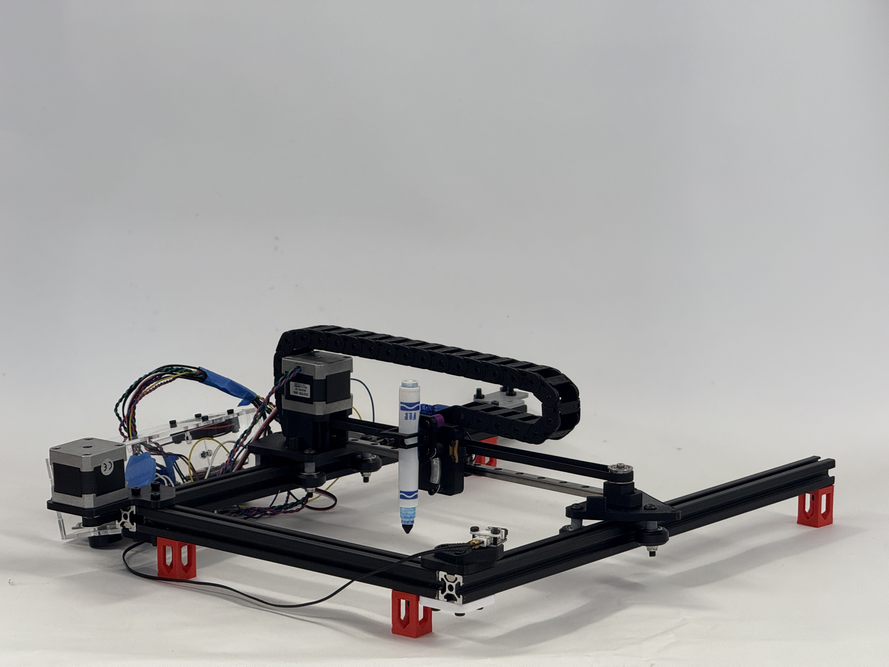
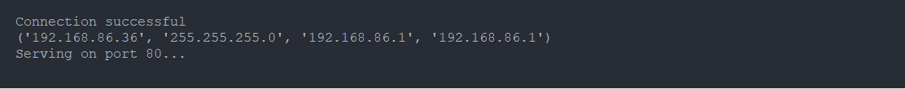
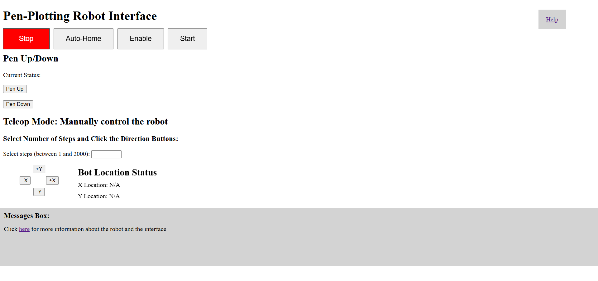

<div align="center">

  <h1>Pen-Plotting Robot</h1>
  
  <p>
    An open-source, python-based cartesian pen-plotting robot for CS education
  </p>
  

<h4>
    <a href="https://www.youtube.com/watch?v=KgujtE1zDqk">View Demo</a>
  <span> · </span>
    <a href="https://cad.onshape.com/documents/94f0b3225bc3cee80dd6bd7f/w/86bde690ac0739bb1e270967/e/8b0488b3bb58129bb2a0aa1e">CAD Model</a>
  </h4>
</div>

<br />

<!-- Table of Contents -->
# :notebook_with_decorative_cover: Table of Contents

- [About the Project](#about-the-project)
  * [Motivation](#motivation)
  * [Tech Stack](#tech-stack)
- [Getting Started](#getting-started)
  * [Prerequisites](#bangbang-prerequisites)
  * [Installation](#gear-installation)
    * [Step 1: Set up Micropython](#step-1-set-up-micropython)
    * [Step 2: Edit script.py and other files locally:](#step-2-edit-scriptpy-and-other-files-locally)
  * [Editing Code](#editing-code)
    * [How Everything Works](#how-everything-works)
    * [About `bot.py`](#about-botpy)
    * [Asynchronous Programming](#Asynchronous-programming)
    * [Key Functions](#key-functions)
  * [Run Locally](#running-run-locally)
    * [Run Code](#run-code)
    * [Upload Files](#upload-files)
    * [User Interface](#user-interface)
- [Contact](#handshake-contact)
- [Acknowledgements](#gem-acknowledgements)

  

<!-- About the Project -->
## About the Project

### Motivation
This project was in response to a request by the EGR105L first-year computing course at Duke University. 


<div align="left"> 
  
</div>


<!-- TechStack -->
### Tech Stack

- Micropython: An efficient implmentation of the Python 3 language optimized for running on microcontrollers.
  - `bot.py`: A low level library that deals with robot control and direct microcontroller communication as well as simple controls functions so you can focus on developing higher-complexity algorithms.
  - `main.py` and `boot.py`: ESP32 native files that are run upon startup.
  - `script.py`: A canvas for the user to write and test their own commands and methods.
- HTML/JS/CSS: Implementation of a socket web server for a User Interface and diagnostic dashboard.

<!-- Getting Started -->
## 	:toolbox: Getting Started

<!-- Prerequisites -->
### Prerequisites


Before starting this project, you should have some sort of code editor installed (VSCode highly recommended) as Thonny IDE is not a good development environment and mostly serves as a conduit to run the ESP32 microcontroller on the robot. You should also have the assembled robot (see [Documentation](https://www.google.com) for more information) and an ESP32.

Additionally, it is highly recommended that you have git installed and set up, and that you fork this repository, since you will need to make changes to `script.py`. You are welcome to play around with any files, but for the smoothest results, it is recommended that you do not modify `main.py`, `boot.py`, `bot.py`, or `interface.html`, instead using the UI and `script.py` to do any robot operations you need.

<!-- Installation -->
### Installation

#### Step 1: Set up Micropython 

If you have not installed micropython on your ESP32 or downloaded Thonny, start here. If you've already completed these two steps or are working with an already setup robot, skip to the next step.

First, go to the [Thonny IDE](https://thonny.org/) website and download the correct version according to your operating system.

Next, plug in the ESP32 microcontroller into your computer and open Thonny. Click `Run -> Configure Interpreter -> Which kind of interpreter? -> Select Micropython (ESP32)`.
<div align="left"> 
<br>
  
</div>
<br>

Next, click `Install or Update MicroPython` and using the following options, install micropython. Usually, the correct port option will say something like "USB Serial" or "UART", but depends on your device and the ESP-32 you have. After you've selected the right port, you should click `install`. This will take a minute or two.

<br>
<div align="left"> 
  
</div>
<br>

Now, you should have both Thonny set up and installed Micropython on your ESP32. You can test this by connecting your device in Thonny In the main menu, select `Run -> Configure Interpreter -> Which kind of interpreter? -> Select Micropython (ESP32)` and select `<Try to detect port automatically>`. Once you connect by pressing `OK`, you should be able to type basic commands in the REPL (Terminal) like below. If this works, then you have successfully completed configuration. If not, start Step 1 again, and if issues persist, consult Google or contact us.

<br>

<div align="left"> 
  
</div>

<br>

#### Step 2: Edit script.py and other files locally:

First, fork this repo. You can do that at the top with the button that says `Fork`. 

Next, open your terminal (or the terminal in VS Code or other IDEs of your chosing) and clone the repo with either HTTPS or SSH (SSH recommended).

```bash
git clone git@github.com:srinath-iyer/Pen-Plotting-Bot.git
```

Additionally, if you don't want to use git, you can export the repo as a zip file and open it in any IDE.

<br>

Next, change the JSON in `network.txt`. If you are joining an open network, just change the network SSID, and set the Password parameter to `None`. If you are joining a network that requires a password, set the Password parameter as well. For example, `network.txt` should be like the following:

Open: 
```bash
{"SSID":"DukeOpen","Password":"None"}
```

Closed:
```bash
{"SSID":"ClosedNetwork","Password":"1234"}
```
You can test that your wifi setup works, and we recommend this before you start coding. Plug in the ESP-32, and open Thonny. In our experience, Thonny sometimes auto connects, and causes the ESP32 to start running the files. If that happens, `Ctrl+C` will interrupt execution. If you then click `View` in the top menu, and click `Files`, you will be able to see all the files on your local computer and the ESP-32 as well. Select the files you want to upload to the ESP-32, right click, and click `Upload to MicroPython Device`. Then to restart execution, click either the 'EN' button on the ESP-32 or click the Red Stop button in the top left menu. To confirm that wifi works, wait for this in the REPL:

<div align="left"> 
  
</div>

If you have an issue with connecting the ESP-32, go to `Run -> Configure Interpreter -> Pick the right Port -> Ok` and the ESP-32 should run. If it doesn't run after connecting, press the `EN` button on the ESP-32. If it still doesn't work, try configuring the interpreter again.

Once you have successfully connected to the network of your choice type `Ctrl+C` to interrupt execution, you are ready to begin editing `script.py`. 

IMPORTANT: If `Ctrl+C` doesn't seem to work, you have a few options. Firstly, click `Stop` and try `Ctrl+C` again. If that doesn't work, close Thonny and reopen, or unplug the ESP-32 and plug in. A combination of these should work. Absolutely worst case, you can [reflash MicroPython](#step-1-set-up-micropython) via Thonny. This is a weird issue that we haven't been able to solve. If you figure it out, [open an issue](https://github.com/srinath-iyer/Pen-Plotting-Bot/issues) and let us know. Thanks!


<!-- Running Tests -->
### :test_tube: Editing Code

#### How Everything Works

Before you start to work with the code, we think it's important that you should know how everything works. 

#### About `bot.py`

#### Asynchronous Programming

Asynchronous programming is one of the driving frameworks of the codebase. We'll give a basic explanantion of what it is and why we use it, as well as how to call functions, but for more theoretical understanding, we suggest doing your own research.

##### How regular code works:

Programming that you are most likely familiar with is Synchronous in nature. That means that everything happens in order. Let's say we make an API call that will take 5 seconds to return a result. This means that the code is blocked for that 5 second duration - no other actions can be performed. You can imagine why this would be bad for a robot, or the web server. If we're running a script on the robot, and we want to do something else mid-script, like pen-up/down or even disabling the robot is something is going wrong, we don't want the script to be blocking the code. If we wrote everything synchronously, then the robot would be unable to take any further input while it's performing any action.

The solution to this is asynchronous programming; from a high level, async programming allows us to call APIs, but not have them block the code. So in the example above, calling the 5 second API wouldn't block the code for 5 seconds; instead, it returns an awaitable object, and then schedules to run the called async function in the background which then returns a final result. This is why we use the `await` keyword when calling async functions. Additionally, within our async funcions, we have lines of code that give control back to the main control loop, allowing more commands to be added on even mid long scripts.

There is a lot more nuance to the architecture of asynchronous programming, so if you're interested, we suggest reading further. However, an in-depth understanding of async programming is not at all required for writing code.

#### Key Functions

Here are some key functions that will be useful to get the robot to perform actions:

```python
  await robot.go_to(x_coord, y_coord, logger = False)
  robot.pen_up()
  robot.pen_down()
  await robot.auto_zero()
  await robot.get_status()
```

- `go_to()`: This is the most important function you will use. Specify x and y coords (in millimeters) while are according to a zero point. Logger is an optional parameter that if you select as True, will print the robot's coordinates to the terminal. This can be useful for troubleshooting and vizualization/validation of robot paths. The profile from the robot's current position to its desired position is linear.
- `pen_up()` and `pen_down()`: Moves the pen up and down to only draw when the pen is down.
-  `auto_zero`: Calls a predetermined routine to zero the robot. Zeroing (also known as Auto Homing) is a procedure that allows the robot to move to a known position. It does this by moving until it hits a limit switch in x and y, therefore setting the robot's position consistently at the same point. This point is given coordinates (0,0).
- `get_status()`: This is probably not needed as much unless for troubleshooting reasons (or for more detailed vizualizations). It returns a list of x and y coordinates, whether the pen is up/down, and whether the robot is enabled.

Note that some functions are asynchronous, and others are synchronous. `pen_up()` and `pen_down()` are synchronous because they happen very quickly, so they block the code for a fraction of a second. Other methods like Auto Homing can take up to 20 seconds, so they most certainly need to be written asynchronously.

<!-- Run Locally -->
### :running: Run Locally

Now that you've written a script, here's how to run it:

Tip: Be aware that the ESP-32 has limited memory (on the order of a few megabytes), so any complex calculations (es. involving image processing) should be done locally and the final result of commands (we recommend a text file of coordinates and then read from that file in `script.py`) should be on the ESP-32.

### Run Code

You can do this in Thonny by clicking the `Stop` button, which essentially restarts the device, or with the `EN` button on the ESP-32.

### Upload Files

If you have an ESP-32 that wasn't provided by us, you will need to upload files from your local computer to the ESP-32. Click `View` in the top menu, and click `Files`, you will be able to see all the files on your local computer and the ESP-32 as well. Select the files you want to upload to the ESP-32, right click, and click `Upload to MicroPython Device`. If you get an error because the ESP-32 is running, try clicking `Stop` and then `Ctrl+C` to interrupt execution, and then try uploading again.

### User Interface

While writing scripts are useful for custom control of the robot, you might want to control when to start certain actions, make interruptions, or be able to monitor the robot's status in a less overwhelming way (the terminal, especially in Thonny can be a bit hard to monitor). For these things, we've provided you with a User Interface in the form of a websocket server. This plays off of the ESP-32's wifi connection abilities, creating a connection between itself (the server) and your browser (the client). Through this connection, we're able to transfer back and forth information and commands to make the robot a truly responsive, highly-controlable system. By following the steps above to connect to a network and checking that it works, you will see a line like this in the terminal:

```bash
Connection Successful
(List of IP Addresses Here)
```

Copy-paste the first IP address into your browser (it might be something like 10.146... or 192.168...), and you should see the UI page load. This is what you should roughly see (mild updates will have been made):

<div align="left"> 
  
</div>

Here's a summary of what buttons do what:

- Stop: Disables the robot by literally telling the motors to not move. This should be used in emergencies (or when `Ctrl+C` doesn't work because the ESP-32 is unresponsive), and if you press the enable button again, the robot will continue its previosuly scheduled actions (ie. continue a script from where it left off). Therefore, we suggest using this to pause your program, and then either `Ctrl+C` or unplugging the ESP-32 to stop code execution.
- Auto-Home: Homes/Zeros the robot. This is required to run scripts (technically the script will run, but the robot will have to automatically zero first) because the robot needs to know where it is.
- Enable (Now called Enable Motors): Enables the motors allowing the robot to move. This is used to undo the Stop button if you want to continue a script. By default, the robot is enabled upon initialization.
- Run (Now called Start Script): This tells the robot to find the main function in `script.py` and run it. This is why we require you to follow this convention in `script.py`.
- Pen Up/Down: Move pen up and down
- Teleop Section: This is more of a fun feature rather than something actually useful for scripts, but this allows you to select any number of steps (each step is 0.2 mm of movement) and a direction to move in. Play with this at your own risk, because there are few checks for out of bounds.

In addition, there are sections in the UI that give you information. These are the messages section, the coordinates section, and the Pen location section. We do this so you can see the robot's status information in a much less overwhelming, clearer, and concise way.

Typically, you will use the Auto Home and Start Script buttons, and occasionally the Stop button as well.

<!-- License -->
## :warning: License

Distributed under the MIT License. See LICENSE.txt for more information.


<!-- Contact -->
## :handshake: Contact

If you have any questions, suggestions, or ideas for how to improve this project, please open an [issue](https://github.com/srinath-iyer/Pen-Plotting-Bot/issues) or feel free to contact one of us! We hope to incorporate more functionality into the robot, and also welcome any ideas for future mechanical revision.

Srinath Iyer - srinath.iyer@duke.edu
<br>
Niko Weaver - niko.weaver@duke.edu
<br>
Kelvin Zhang - kelvin.zhang@duke.edu
<br>
Jack Voelker - jack.voelker@duke.edu


<!-- Acknowledgments -->
## Acknowledgements

We would like to thank Duke University, and the Pratt School of Engineering First Year Design program for providing us financial support and mentorship.

Specifically, we would like to extend our gratitude to Dr. Delagrammatikas, Dr. Lipp, Dr. Smith, Dagan Trnka, and Rodrigo Bassi Guerreiro for their assistance on this project.
